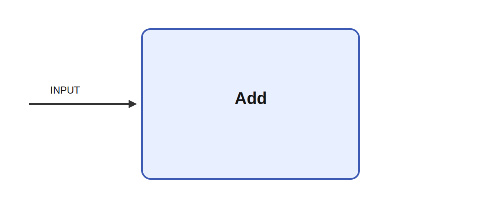

# Add

## Description

Prints its input to the console each tick; alias is used as label if set on connetion.

It receives INPUT. A meaningful use case is to place the module inside a larger sensorimotor or
cognitive architecture where it helps transform, summarize, or route signals between neural
subsystems and robot effectors.

## Inputs

| Name | Description | Optional |
| --- | --- | --- |
| INPUT | The input to be printed. |  |

*This description was automatically created and may not be an accurate description of the module.*
