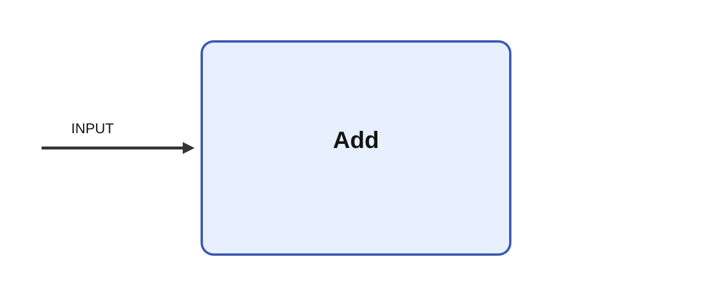

# Print

## Description

Prints its input to the console each tick; the connection label is used if set on the connection.

`INPUT` is optional and may have any shape. When connected, the module prints its values once per
tick and uses the connection label when one is available.

## Inputs

| Name | Description | Optional |
| --- | --- | --- |
| INPUT | The input to be printed. |  |
