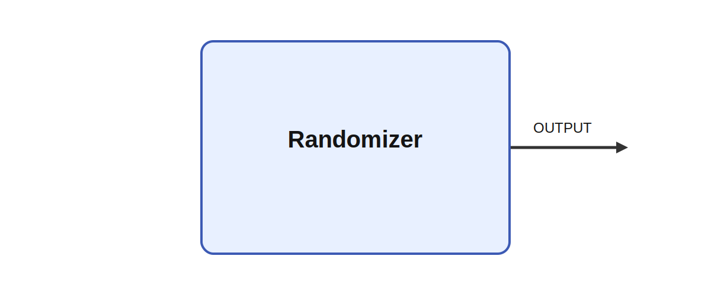

# Randomizer

## Description

Outputs a random value. Randomizer fills its output with fresh uniformly distributed random values
on every tick. The code uses the configured min and max bounds and applies the random draw element-
wise to the OUTPUT matrix, which makes the module useful for stochastic inputs, noise injection, and
quick tests.

It produces OUTPUT while parameters such as size, min, and max shape its behavior. That is valuable
when injecting controlled noise into decision circuits, sampling exploratory motor commands for
stochastic search, or modeling trial-to-trial variability in sensory or neuromodulatory input
streams.

## Parameters

| Name | Description | Type | Default |
| --- | --- | --- | --- |
| size | output from module | string | 2,3 |
| min | Minimum value of the output (inclusive) | float | 0 |
| max | Maximum value of the output (inclusive) | float | 1 |

## Outputs

| Name | Description |
| --- | --- |
| OUTPUT | The output |

*This description was automatically created and may not be an accurate description of the module.*
