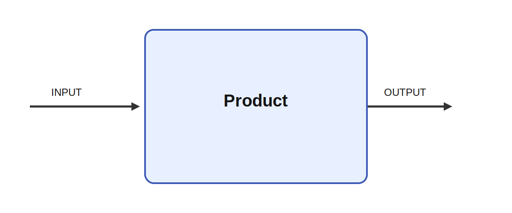

# Product

## Description

Claculates the products of all elements in the input. Product is a reduction module that computes
the product over all elements of its input. These modules are useful when a full matrix or vector
needs to be summarized into a compact signal that can drive later decision, control, or analysis
stages in an Ikaros network.

It receives INPUT and produces OUTPUT. These reductions are useful when a distributed population
activity must be collapsed into a compact decision variable, confidence estimate, or control scalar
that can drive action selection or adaptive robot behavior.

## Inputs

| Name | Description | Optional |
| --- | --- | --- |
| INPUT | The input |  |

## Outputs

| Name | Description |
| --- | --- |
| OUTPUT | The output with the Product |

*This description was automatically created and may not be an accurate description of the module.*
