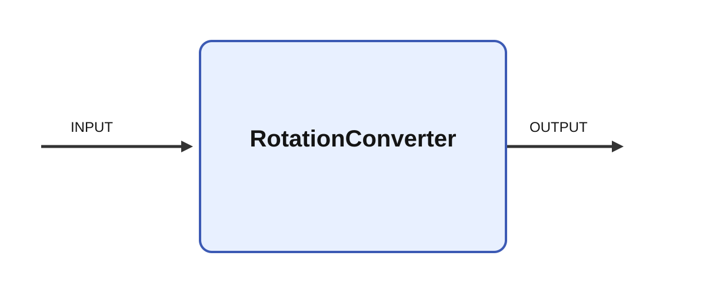

# RotationConverter

  
## Short description

Converts between rotation notations

  

## Inputs

|Name|Description|Optional|
|:----|:-----------|:-------|
|INPUT|Input|No|

  

## Outputs

|Name|Description|
|:----|:-----------|
|OUTPUT|Output|

  

## Parameters

| Name | Description | Type | Default |
| --- | --- | --- | --- |
| input_format | Format of the input | number | xyz |
| output_format | Format of the output | number | xyz |
| angle_unit | Angle unit; tau is a legacy alias for turns | number | degrees |
| size_x | Size of the output | number | 4 |
| size_y | Size of the output | number | 4 |

## Long description
Module that converts between different 3d point/angle notations.
