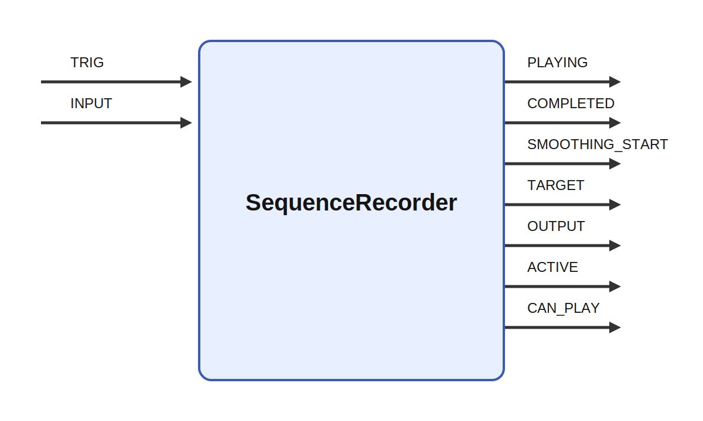

# SequenceRecorder

  
## Short description

Records a sequence

  

## Inputs

|Name|Description|Optional|
|:----|:-----------|:-------|
|TRIG|Start a behavior with a 1 in the column for that behavior|Yes|
|INPUT|Position data from the servos|No|

  

## Outputs

|Name|Description|
|:----|:-----------|
|PLAYING|Element for each sequence set to 1 while that sequence is playing|
|COMPLETED|Element for each sequence set to 1 for one tick when that sequence is completed|
|COLOR|Copy of the RGB color matrix for each sequence|
|LIMITING|Set to 1 while the max_speed limiter is reducing output motion|
|ERROR|Set to 1 when a playback error has occurred|
|TRIG_OUT|A single 1 for one tick when a behavior is started|
|MODE|Off/stop/play/record mode for each channel coded as a matrix|
|OUTPUT|Position data to the servos|
|TORQUE|Current torque for the motors|
|ENABLE|Enable the motors|
|KEYPOINTS|The keypoint vectors|
|TIMESTAMPS|Timestamp in seconds for each keypoint in version 2 sequence files|
|LENGTHS|Lenghts of the recording|
|STATE|State is 1 when the module records|
|TIME|Current record or play position|

  

## Parameters

|Name|Description|Type|Default value|
|:----|:-----------|:----|:-------------|
|positions|Positions of recorder that can be used by for example sliders to control the input.|array||
|output_size|Requested output size. can be larger than connected input.|int||
|max_sequences|The maximum number of different behaviors that can be recorded|int|64|
|layout_width|Number of sequence buttons per row in WebUI layouts|int|8|
|color|RGB color for each sequence, with one row per sequence and three columns.|matrix|zeros shaped @max_sequences,3|
|current_motion|The behavior that will be recorded|int|0|
|position_data_max|The maximum number of datapoints that can be stored|int|1000|
|mode_string|The current mode as a string|string|stop|
|filename|The name(s) of the files where the data will be stored.|string|motion.%02d.dat|
|directory|The directory where the files will be stored.|string|motions|
|torque|Initial torque used during play. single value or array of values for each servo.|array|0.2|
|smoothing_time|Number of ticks to smooth the output position and torque.|float|100|
|max_speed|Maximum output speed for each channel in units per second. A value of 0 disables speed limiting for that channel.|matrix|zeros shaped @channels|
|auto_load|Load all saved behaviors on start-up|bool|yes|
|auto_save|Save all behaviors before termination|bool|no|
|record_on_trig|Start record on trig input.|bool|false|

  
## Long description
Module that records a sequence of values and saves them into a file.

Sequence files are stored as JSON. In current files the sequence metadata includes `version`, `time_unit`, `channels`, `ranges`, `color`, and `sequences`. The `color` field stores one RGB row per sequence and is restored into the fixed `color` matrix when a file is opened. Old files without `color` still load and keep the module's current/default colors.
