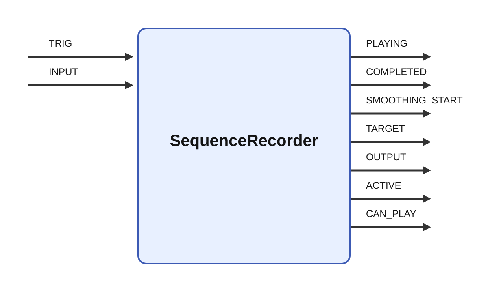

# SequenceRecorder

  
## Short description

Records a sequence

  

## Inputs

|Name|Description|Optional|
|:----|:-----------|:-------|
|TRIG|Start a behavior with a 1 in the column for that behavior|Yes|
|INPUT|Position data from the servos|No|

  

## Outputs

| Name | Description |
| --- | --- |
| PLAYING | Element for each sequence set to 1 while that sequence is playing |
| COMPLETED | Element for each sequence set to 1 for one tick when that sequence is completed |
| COLOR | Copy of the RGB color matrix for each sequence |
| LIMITING | Set to 1 while the max_speed limiter is reducing output motion |
| ERROR | Set to 1 when a playback error has occurred |
| SMOOTHING_START | Sposition to smooth from. Used only for debugging. |
| TARGET | The target positions or the interpolated keypoint positions that the output moves towards |
| OUTPUT | The current output positions |
| ACTIVE | Indicates that the data on the output should be used, for example for torque enable. |
| CAN_PLAY | A one on a channel indicates that there is data to be played. Used to enable play buttons |

## Parameters

| Name | Description | Type | Default |
| --- | --- | --- | --- |
| directory | Directory for sequence files | string | Sequences |
| filename | Default name for sequence file | string | sequence.json |
| max_sequences | The maximum number of different behaviors that can be recorded | number | 64 |
| layout_width | Number of sequence buttons per row in WebUI layouts | number | 8 |
| color | RGB color for each sequence, with one row per sequence and three columns. | matrix |  |
| smoothing_time | Maximum time in seconds to smooth sudden output position jumps. | number | 1 |
| max_speed | Maximum output speed for each channel in units per second. A value of 0 disables speed limiting for that channel. | matrix |  |
| simplify_epsilon | Maximum interpolation error allowed when simplifying keypoints. | number | 1 |
| state | State array used to remember control button state. Only for output to control buttons. | matrix | 1, 0, 0, 0, 0 |
| channel_mode | Mode for each channel: lock, play, record, etc. | matrix | 0, 0, 0, 0 |
| interpolation | Type of interpolation for each channel: 0 = none; 1 = linear | matrix | 1, 1, 1, 1 |
| range_min | Min value | matrix | 0, 0, 0, 0 |
| range_max | Max value | matrix | 1, 1, 1, 1 |
| time | String representation of the current time. | string | 00:00:000 |
| end_time | String representation of the end time. | string | 00:00:000 |
| position | Position in sequence from 0 to 1. | number | 0 |
| mark_start | Position of start mark in sequence from 0 to 1. | number | 0 |
| mark_end | Position of end mark in sequence from 0 to 1. | number | 0 |
| loop | Loop sequence. | bool | false |
| shuffle | Shuffle sequence. | bool | false |
| channels | The number of channels to record and/or play. | number | 4 |
| default_output | Default outputs to be used when not defined in any other way. | matrix | 0, 0, 0, 0 |
| internal_control | A 1 indicates that the parameter sliders should be used to set the values to be recorded and not the input. | matrix | 0, 0, 0, 0 |
| positions | Current positions for all channels; input/output for WebUI | matrix | 0, 0, 0, 0 |
| current_sequence | Index of the currently selected sequence | number | 0 |
| sequence_names | List of names for the different sequences | string | Sequence A |
| file_names | List of file names for sequence files in the current directory | string |  |

## Long description
Module that records a sequence of values and saves them into a file.

Sequence files are stored as JSON. In current files the sequence metadata includes `version`, `time_unit`, `channels`, `ranges`, `color`, and `sequences`. The `color` field stores one RGB row per sequence and is restored into the fixed `color` matrix when a file is opened. Old files without `color` still load and keep the module's current/default colors.
