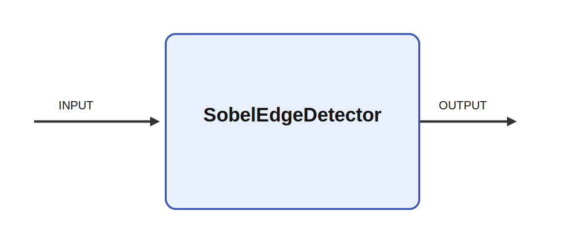

# SobelEdgeDetector

## Description

Canny edge detector for grayscale images. Register the module with Ikaros

It consumes INPUT and produces OUTPUT while parameters such as sigma shape its behavior. In a non-
trivial vision stack, that makes it useful for building layered perception pipelines that support
active attention, object-directed reaching, scene segmentation, or visually guided robot navigation.

Sobel filtering approximates the local image gradient, which makes it a compact way to expose
directional intensity changes before more elaborate visual processing. It is often useful for
motion- and contour-sensitive pathways, tactile image preprocessing, or robot vision pipelines where
edge strength should be estimated cheaply and fed forward into higher-level segmentation or
recognition.

## Parameters

| Name | Description | Type | Default |
| --- | --- | --- | --- |
| sigma | Standard deviation for Gaussian blur | float | 1.0 |

## Inputs

| Name | Description | Optional |
| --- | --- | --- |
| INPUT | Grayscale input image (2D matrix) |  |

## Outputs

| Name | Description |
| --- | --- |
| OUTPUT | Binary edge map (2D matrix) |

*This description was automatically created and may not be an accurate description of the module.*
